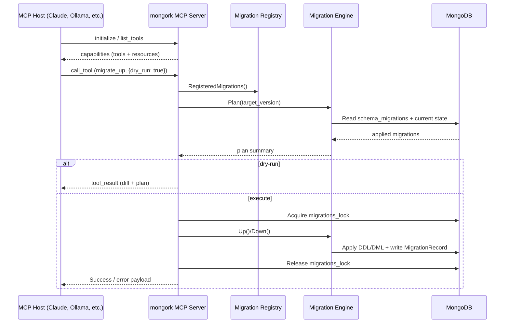

# MCP Architecture & Lifecycle

This document explains how the MCP (`mongo mcp`) server boots, how requests coming from an AI host are translated into migration engine operations, and which safeguards keep your database safe when sessions drop unexpectedly.

## Component boundaries

*The MCP host communicates over JSON-RPC on stdin/stdout; logs are routed to stderr so protocol frames stay clean.*

Fallback summary (for renderers that don’t support Mermaid):
Client sends JSON-RPC requests to the MCP server → server loads migrations → engine plans or executes → MongoDB is mutated under a distributed lock → results are returned to the host.

## Lifecycle summary

1. **Bootstrap**  
   `mongo mcp` loads configuration/env, validates that at least one migration is registered, and establishes a MongoDB client. If `--with-examples` is set, both the simple `examples/examplemigrations` set and the zero-downtime scenarios under `examples/practical/...` are registered.
2. **Handshake**  
   When a host (Claude Desktop, Ollama, etc.) launches the MCP binary it sends `initialize` and `list_tools`. The server responds with tool descriptors (`migration_status`, `migration_up`, `schema_diff`, etc.) and any resources (documentation links).
3. **Tool invocation**  
   For each `call_tool` request, arguments are validated against the JSON schema embedded in the handler before touching MongoDB. Invalid payloads are rejected locally so the engine never sees malformed directives.
4. **Planning vs execution**  
   `dry_run: true` routes the request through `Engine.Plan` and the schema/index diffing helpers without mutating Mongo. When execution is requested the engine acquires the distributed lock, runs migrations (with transaction retry + checksum validation), and finally writes an audit record back to the MCP host.

## State management & migration locks

| State | Owner | Notes |
| --- | --- | --- |
| `migrations_lock` collection | MCP server | Ensures only one engine instance runs at a time. Locks have a 10-minute TTL; force releases are exposed via `mongo unlock` or the MCP `migration_unlock` tool. |
| `schema_migrations` collection | Engine | Stores version, description, checksum, and applied timestamp. Used for status/diff reports and for detecting checksum drift. |
| `migration_progress` collection | Example migrations | The practical scenarios use shared checkpoint docs so long-running backfills can resume if the host exits. |

If a host disconnects (e.g., the LLM client crashes) the MCP process receives `EOF`. Before exiting it calls `releaseLock`, but if the process is SIGKILLed administrators can run `mongo unlock` or delete the lock document manually.

## Failure scenarios & recovery

- **Checksum mismatch** – Before applying an `Up` step that already appears in `schema_migrations`, the engine compares the stored SHA-256 with the compiled migration. MCP surfaces this as a structured error so tooling can prompt engineers to reconcile the drift.
- **Transaction rollback** – `Engine.executeWithRetry` wraps migrations in transactions when the cluster supports them (replica sets / sharded clusters with CSRS). If a migration panics or MongoDB returns a retryable error, the transaction is aborted before the lock is released.
- **Network interruption** – When the Mongo client loses connectivity, the `mongo-driver` surfaces context errors. The MCP server converts these into JSON-RPC failures and includes guidance to run `mongo unlock` if needed. Backfill examples persist checkpoints so operators can simply rerun the migration.
- **Dirty database / resume-ability** – Integration tests cover scenarios where half the batches have been processed. The new schema diff command can also warn when indexes or validators are already present, preventing accidental duplicate work.

## Security & host responsibility

- The MCP binary inherits credentials from the environment (e.g., `MONGO_URL`, `MONGO_DATABASE`). Hosts should run it with least-privilege DB users.
- Tool schemas require explicit `--yes` or `confirm` flags for destructive actions; LLM hosts should prompt users before sending `migrate_down` or `schema_diff --apply`.
- MCP hosts must monitor stderr for `zap` logs—these include lock IDs, database names, and error traces useful for SOC/audit workflows.

## Extending the server

1. **Add your migration or schema specs** (e.g., register new `migration.Migration`s or `schema.IndexSpec`s).  
2. **Expose a tool handler** under `mcp/handlers.go` that calls existing CLI packages (status, plan, schema diff).  
3. **Document the behavior** by adding a resource entry or extending this file so hosts can surface rich help text to users.  

See `mcp.md` for setup instructions and `mcp/examples` for sample clients.
